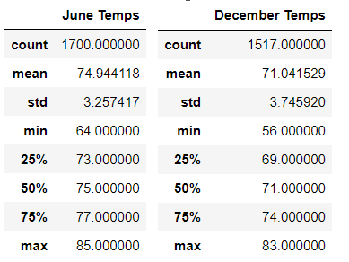
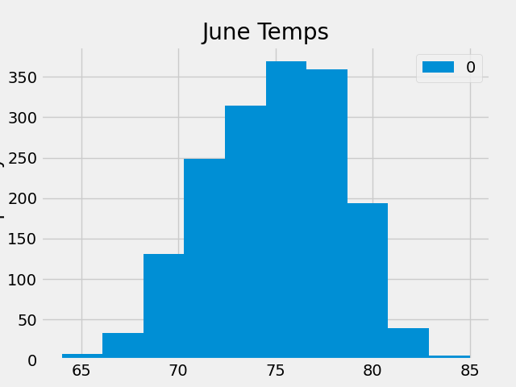
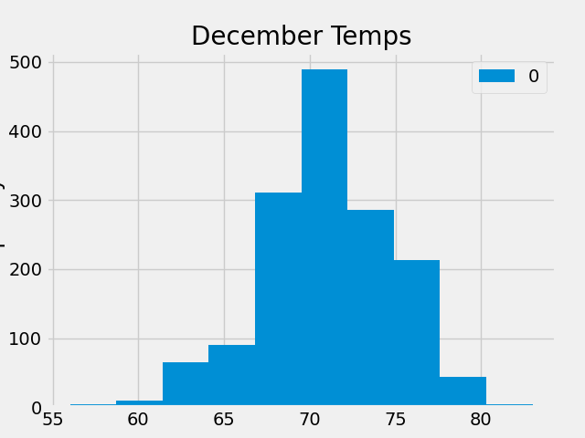

# Surfs-Up
## Introduction
It’s time take a trip to the amazing island of Oahu, Hawai’i! This project is on behalf of W. Avy, whom is running an ice cream shop on Oahu. **Using SQLlite they would like to know the temperature data from June and December to know if their ice cream shop business is suitable year around.** So I help him out with the following analysis. 
## Results
June had slightly warmer weather, averaging at a high of 74 degrees and a low of 64 degrees. However, December is not too far behind at a average of 71 degrees and a low of 56 degrees.
Major key differences between June and December temperature
* Highs: June: 85 degrees, December: 83 degrees
* Lows: June: 64 degrees, December: 56 degrees
* Average: June: 75 degrees, December: 71 degrees

## Summary
Overall, it is sustainable to run the ice-cream business year around due to the slight variance in average temperature. Two additional queries were made to visualize this distribution of temperature to produce the following images. These images directly visualize the distribution of weather temperature, and further confirm that is is sustainable to have an ice cream business year around. 

